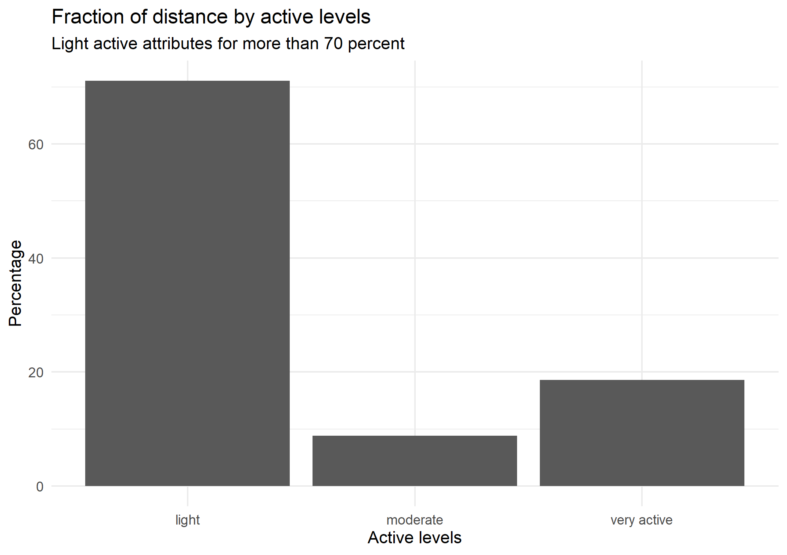
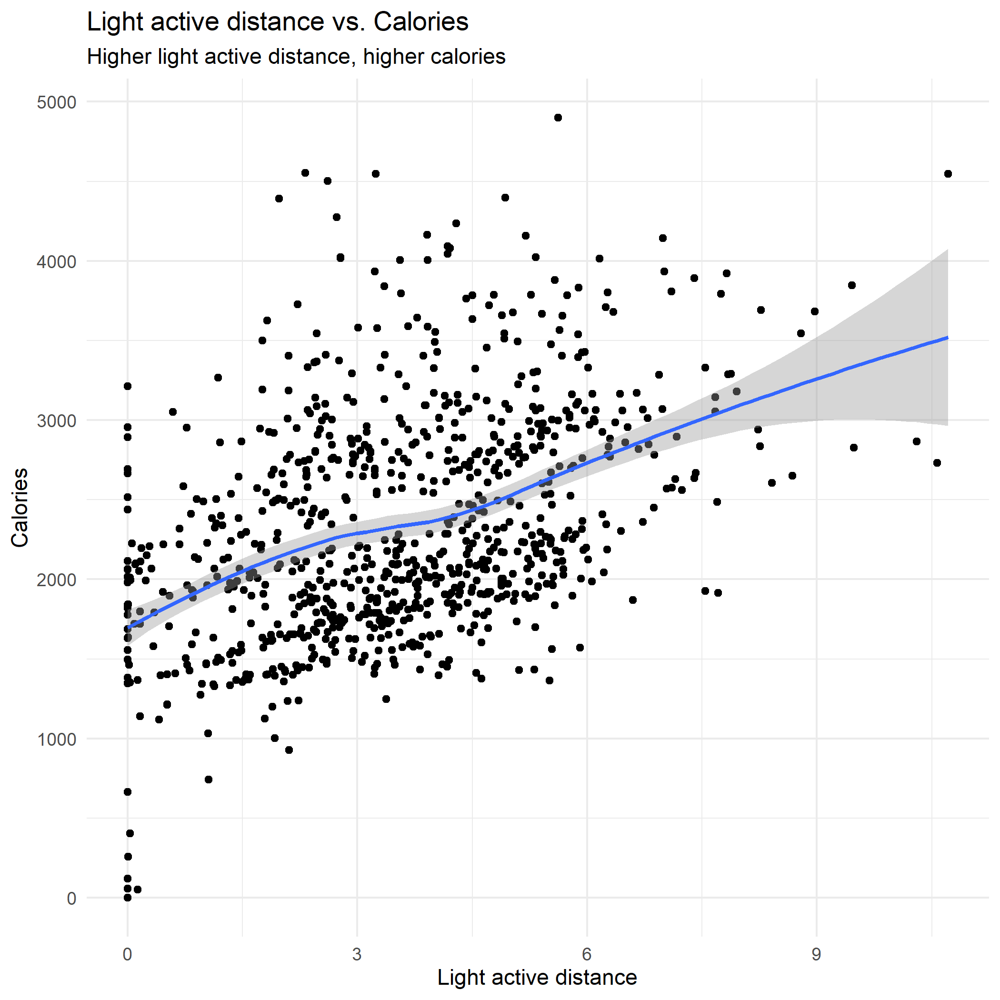
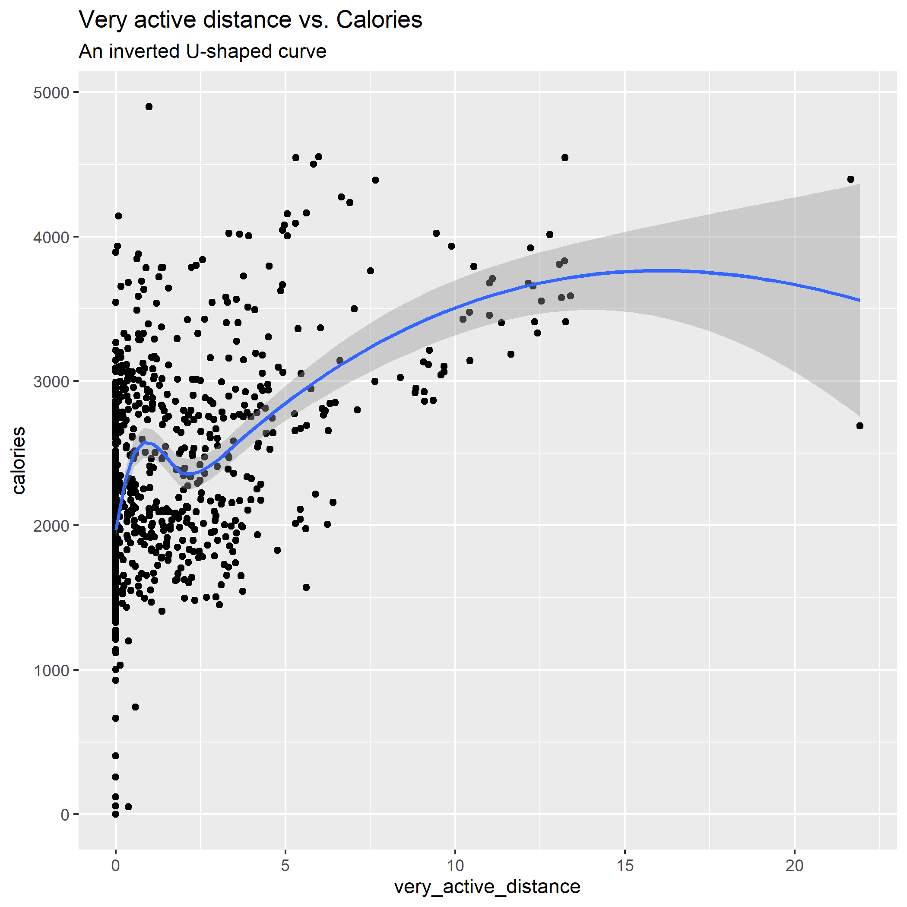
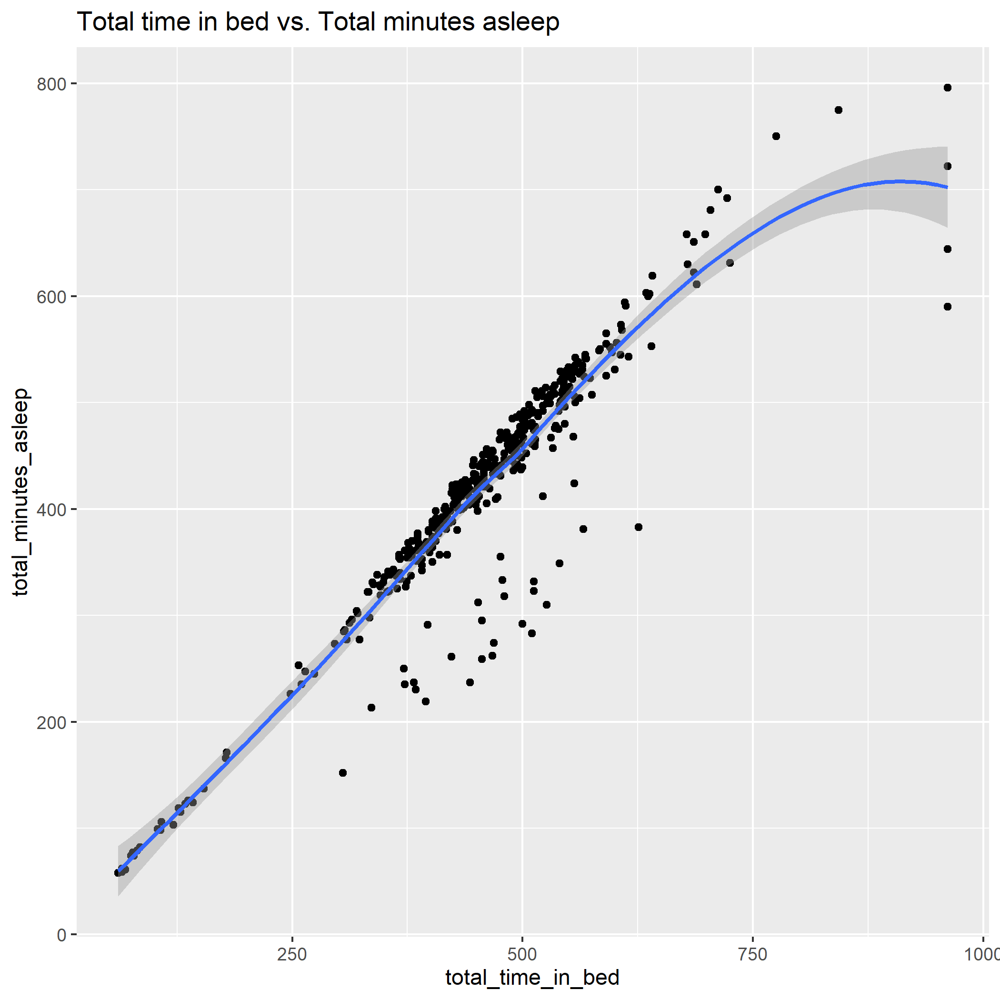

# fitbit
Case study 2 for Google Data Analytics class.

In this case study, I am working as a junior data analyst for a fictional company, Bellabeat, a high-tech manufacturer of health-focused products for women. 

# Ask

Urška Sršen, cofounder and Chief Creative Officer of Bellabeat, believes that analyzing smart
device fitness data could help unlock new growth opportunities for the company. I have been asked to focus on one of
Bellabeat’s products and analyze smart device data to gain insight into how consumers are using their smart devices. The
insights I discover will then help guide marketing strategy for the company. 

# Prepare and Process

- Data: trip data from this [link](https://www.kaggle.com/arashnic/fitbit).
- Analytics tool: R programming for 2 main reasons:
    - The data is big so working with a spreadsheet is slowly and lagging
    - Easy to reproduce the code and findings

# Analyze

- Code: in the `code` folder, we have an [Rmd code file](code/01_fitbit.Rmd).

- Some key findings are:

1. Most of time, people just have light activities (more than 70%).

2. There is a positive relation between light activites and calories.

3. There is an inverted U-shaped relation between very-active activities and calories. It means that after some very active time, the calories will not increase at the same pace as initially.

4. Compare to other active levels, light activities have the strongest effect on calories through a simple OLS regression analysis.

5. There is a positive relation between time on bed and the number of minutes asleep.

# Share 

- Presentation of the results: [Google slide](https://docs.google.com/presentation/d/1My3k_14z_X04lL7PPPAfVO5ewRSGjpAnJDK_lTh3UC4/edit?usp=sharing) or a slide file in `slide` folder

# Act

I make three recommendations as follow:

1. Motive users to have break time to do some light exercises such as walk around
1. Notify users if they spend too much on very heavy exercises
1. Add function to remind users to sleep after spending some time on bed

# Contact

- Dien Giau Bui (Richard)
- Email: buidiengiau@gmail.com
